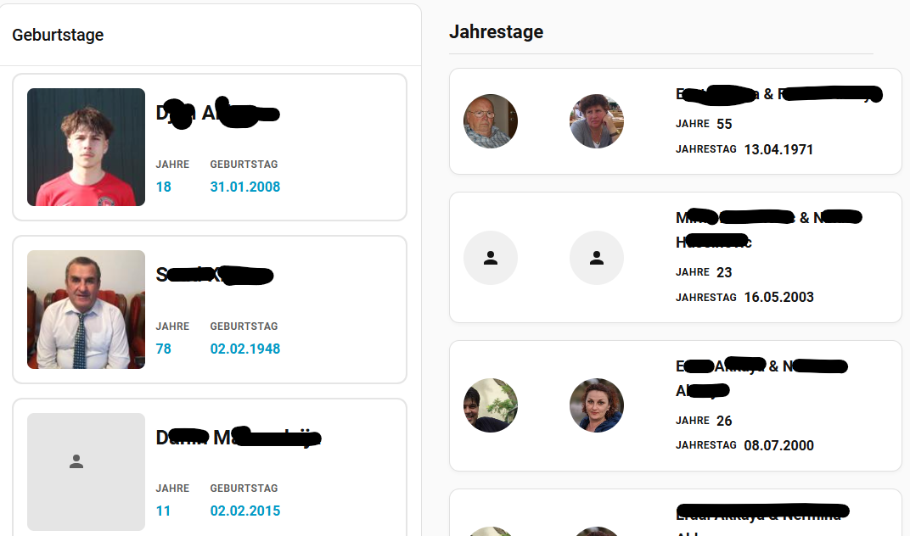
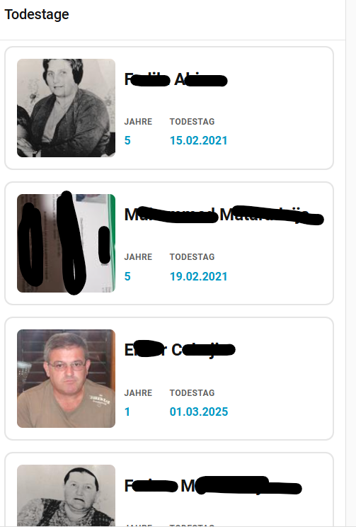

# Gramps Dashboard

Anpassbare Karten für Geburtstage, Todestage und Jubiläen (Anniversaries) in Home Assistant.

## Kartenübersicht

- **Geburtstage:** Zeigt nächste Geburtstage mit Alter (age_entity)
- **Todestage:** Zeigt nächste Todestage mit Jahren seit Tod (years_ago_entity)
- **Jubiläen (Anniversaries):** Zeigt Jahre seit Hochzeit (years_together_entity), Karten werden untereinander angezeigt


## Installation

### HACS (empfohlen)

[](https://my.home-assistant.io/redirect/hacs_repository/?owner=EdgarM73&repository=https%3A%2F%2Fgithub.com%2FEdgarM73%2Fgramps-dashboard-ha&category=Dashboard)

1. Öffne HACS im Home Assistant
2. Gehe zu "Frontend"
3. Klicke auf das Menü (drei Punkte) oben rechts
4. Wähle "Benutzerdefinierte Repositories"
5. Füge die URL dieses Repositories hinzu: `https://github.com/EdgarM73/gramps-dashboard-ha`
6. Wähle "Lovelace" als Kategorie
7. Klicke auf "Hinzufügen"
8. Suche nach "Gramps Dashboard" und installiere es
9. **Wichtig**: Nach der Installation führe einen Hard-Refresh durch (Strg+F5 / Cmd+Shift+R)

### Manuelle Installation

1. Lade die gewünschten JS-Dateien (`gramps-dashboard.js`, `gramps-todestage-dashboard.js`, `gramps-anniversaries-dashboard.js`) herunter
2. Kopiere die Dateien nach `<config>/www/`
3. Füge die Ressourcen in Home Assistant hinzu:
  - Gehe zu Einstellungen → Dashboards → Rechts oben auf Menü → Ressourcen
  - Klicke auf "+ Ressource hinzufügen"
  - URL: `/local/gramps-dashboard.js` (bzw. ...-todestage... oder ...-anniversaries...)
  - Ressourcentyp: **JavaScript-Modul**
4. **Wichtig**: Führe einen Hard-Refresh im Browser durch (Strg+F5 / Cmd+Shift+R)


## Verwendung

Nach der Installation erscheinen im Karten-Picker drei Karten:
- **Gramps Dashboard (Geburtstage)**
- **Gramps Todestage Dashboard**
- **Gramps Anniversaries Dashboard**

**Wichtig bei Updates:** Nach jedem Update der Karten (z.B. über HACS), führe einen **Hard-Refresh** im Browser durch:
- **Windows/Linux:** Strg + F5 oder Strg + Shift + R
- **macOS:** Cmd + Shift + R

### Mit dem visuellen Editor

1. Öffne dein Dashboard im Bearbeitungsmodus
2. Klicke auf "+ Karte hinzufügen"
3. Suche nach "Gramps Dashboard", "Todestage" oder "Anniversaries"
4. Konfiguriere die jeweilige Karte über den Editor:
   - **Geburtstage:** wie bisher (age_entity)
   - **Todestage:** years_ago_entity statt age_entity
   - **Anniversaries:** years_together_entity statt age_entity, Karten werden untereinander angezeigt

### Mit YAML

**Geburtstage:**
```yaml
type: custom:gramps-dashboard-card
title: Geburtstage
entities:
  - name_entity: sensor.next_birthday_1_name
    age_entity: sensor.next_birthday_1_age
    birthdate_entity: sensor.next_birthday_1_date
    image_entity: sensor.next_birthday_1_picture
```

**Todestage:**
```yaml
type: custom:gramps-todestage-dashboard-card
title: Todestage
entities:
  - name_entity: sensor.next_deathday_1_name
    years_ago_entity: sensor.next_deathday_1_years_ago
    deathdate_entity: sensor.next_deathday_1_date
    image_entity: sensor.next_deathday_1_picture
```

**Anniversaries:**
```yaml
type: custom:gramps-anniversaries-dashboard-card
title: Jubiläen
entities:
  - name_entity: sensor.next_anniversary_1_name
    years_together_entity: sensor.next_anniversary_1_years_together
    anniversary_date_entity: sensor.next_anniversary_1_date
    image_entity: sensor.next_anniversary_1_picture
```


## Konfigurationsoptionen

| Option | Typ | Standard | Beschreibung |
|--------|-----|----------|--------------|
| `type` | string | **Erforderlich** | `custom:gramps-dashboard-card` (Geburtstage), `custom:gramps-todestage-dashboard-card`, `custom:gramps-anniversaries-dashboard-card` |
| `title` | string | Optional | Titel der Karte |
| `entities` | list | **Erforderlich** | Liste der anzuzeigenden Personen |
| `theme` | string | `default` | Theme-Name (`default`, `dark`) |
| `show_header` | boolean | `true` | Header anzeigen |
| `image_entity` | string | Optional | Entity für Profilbild (global) |
| `name_entity` | string | Optional | Entity für Name (global) - **Erforderlich pro Person** |
| `age_entity` | string | Optional | Entity für Alter (nur Geburtstage) |
| `years_ago_entity` | string | Optional | Entity für Jahre seit Tod (nur Todestage) |
| `years_together_entity` | string | Optional | Entity für Jahre seit Hochzeit (nur Anniversaries) |
| `birthdate_entity` | string | Optional | Entity für Geburtsdatum (Geburtstage) |
| `deathdate_entity` | string | Optional | Entity für Todestag (Todestage) |
| `anniversary_date_entity` | string | Optional | Entity für Hochzeitsdatum (Anniversaries) |


## Entity-Konfiguration

Jede Person benötigt mindestens eine `name_entity`. Optionale Felder können individuell oder global gesetzt werden. Für Todestage und Anniversaries die jeweiligen neuen Felder nutzen:

```yaml
# Geburtstage
entities:
  - name_entity: sensor.next_birthday_1_name
    age_entity: sensor.next_birthday_1_age
    birthdate_entity: sensor.next_birthday_1_date
    image_entity: sensor.next_birthday_1_picture

# Todestage
  - name_entity: sensor.next_deathday_1_name
    years_ago_entity: sensor.next_deathday_1_years_ago
    deathdate_entity: sensor.next_deathday_1_date
    image_entity: sensor.next_deathday_1_picture

# Anniversaries
  - name_entity: sensor.next_anniversary_1_name
    years_together_entity: sensor.next_anniversary_1_years_together
    anniversary_date_entity: sensor.next_anniversary_1_date
    image_entity: sensor.next_anniversary_1_picture
```

Die `entity`-Eigenschaft ist optional und wird nur für den Click-Handler verwendet (öffnet More-Info Dialog).


## Beispiele

### Gramps Integration (empfohlen)

Im visuellen Editor filtern die Picker automatisch auf die passenden Sensoren (`sensor.next_birthday_*`, `sensor.next_deathday_*`, `sensor.next_anniversary_*`).

**Geburtstage:**
```yaml
type: custom:gramps-dashboard-card
title: Nächste Geburtstage
entities:
  - name_entity: sensor.next_birthday_1_name
    age_entity: sensor.next_birthday_1_age
    birthdate_entity: sensor.next_birthday_1_date
    image_entity: sensor.next_birthday_1_image
```

**Todestage:**
```yaml
type: custom:gramps-todestage-dashboard-card
title: Nächste Todestage
entities:
  - name_entity: sensor.next_deathday_1_name
    years_ago_entity: sensor.next_deathday_1_years_ago
    deathdate_entity: sensor.next_deathday_1_date
    image_entity: sensor.next_deathday_1_image
```

**Anniversaries:**
```yaml
type: custom:gramps-anniversaries-dashboard-card
title: Nächste Jubiläen
entities:
  - name_entity: sensor.next_anniversary_1_name
    years_together_entity: sensor.next_anniversary_1_years_together
    anniversary_date_entity: sensor.next_anniversary_1_date
    image_entity: sensor.next_anniversary_1_image
```


### Beispielbilder

So sieht das Gramps Dashboard in Home Assistant aus:




### Layout-Ergebnis

- Geburtstage und Todestage: Karten im Grid-Layout
- Anniversaries: Karten werden **untereinander** (vertikal) angezeigt

Hinweis: Die jeweiligen Datumsfelder werden im Format `dd.mm.yyyy` angezeigt.


## Support

Bei Problemen oder Feature-Wünschen öffne bitte ein Issue auf GitHub.

## Lizenz

MIT License
